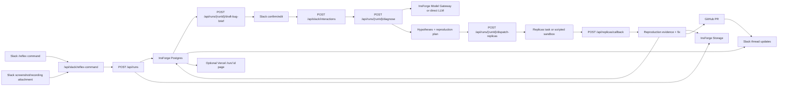

# Reflex Technical Document

## 1. Project Summary

Reflex is a role-aware debugging assistant for agentic software development. A user reports a product problem from Slack, attaches screen context when available, and identifies their role. Reflex converts that moment into a structured engineering symptom, dispatches coding agents to reproduce the issue in sandboxed environments, and opens a pull request with evidence that the bug was reproduced and fixed.

The demo target is the InsForge Hackathon hosted by AI Nexus in San Francisco on June 6, 2026. The event is focused on agentic developer tools, coding agents, autonomous workflows, agent infrastructure, and AI-native engineering systems. The fastest demo implementation is Slack-first: Slack owns the primary user experience, a small webhook/API layer owns orchestration, and InsForge owns the Postgres database, storage, realtime-capable state, and backend project context.

One-line judge pitch:

> Tag who you are in Slack, describe what is wrong, attach the screen evidence if you have it, and Reflex diagnoses the real engineering problem and dispatches coder agents to fix it. From a complaint to a merged PR, without a single ticket written.

## 2. Problem Statement

The people who encounter product failures are often not the engineers who can fix them. Sales, support, founders, and product managers describe symptoms in human terms, while engineering teams need reproducible technical evidence. The current handoff is slow and lossy:

- The bug reporter writes an imprecise ticket.
- Engineering asks for reproduction steps.
- Context is lost between screen recordings, logs, customer impact, and code changes.
- Multiple engineers may investigate the wrong root cause before a fix is proven.

Reflex collapses this gap by treating the original screen-and-voice moment as the source of truth, translating it through the correct role lens, and requiring sandbox reproduction before any fix is considered valid.

## 3. Goals

- Capture a user role, Slack message, and optional screen context.
- Convert vague user language into a structured technical symptom.
- Generate a ranked hypothesis tree tied to codebase context.
- Dispatch a Replicas coding-agent task to reproduce the top hypothesis, with parallel fan-out as a stretch.
- Record reproduction evidence before writing or accepting a fix.
- Open a pull request linked to the original report, reproduction trace, and fix summary.
- Demonstrate sponsor usage in load-bearing parts of the architecture.

## 4. Non-Goals

- Fully robust always-on screen monitoring or a full web recording product.
- Open-ended natural conversation across arbitrary applications.
- Multi-tenant enterprise administration.
- Production-grade privacy redaction for all screen content.
- Guaranteed fix generation for arbitrary repos.
- Native mobile reproduction in the MVP. Limrun is an optional mobile extension.

For the hackathon, Reflex should optimize for a reliable end-to-end spine on one seeded repository and one or two rehearsed symptoms.

## Fastest Demo Stack

The fastest credible version is:

```text
Slack + InsForge + Replicas + GitHub API
```

Do not add Supabase for the MVP. InsForge already provides the backend layer Reflex needs: Postgres database, authentication, storage, realtime, edge functions, and model gateway support. Using InsForge also strengthens the hackathon story because Reflex becomes an InsForge-powered agentic developer tool instead of a generic Slack bot with a separate database provider.

| Layer | Tool | Responsibility |
| --- | --- | --- |
| Primary UI | Slack | Slash command, thread updates, screenshot or recording attachments, final PR link |
| Intake API | Minimal webhook/API layer | Receive Slack commands/events and normalize reports |
| Orchestration | Minimal webhook/API layer | Draft bug brief, collect confirmation, create diagnosis, dispatch agent work, update run state |
| Database | InsForge Postgres | Runs, observations, diagnoses, hypotheses, agent runs, PR metadata |
| File storage | InsForge Storage | Screenshots, recordings, logs, reproduction evidence |
| Live updates | Slack thread updates | Show observe, diagnose, dispatch, reproduce, fix, and ship status |
| AI/model access | InsForge Model Gateway or direct model API | Draft bug brief and generate diagnosis JSON |
| Agent execution | Replicas | Run sandboxed background coding tasks and produce fix evidence |
| PR output | GitHub API | Create branches, commits, and pull requests |
| Optional status UI | Vercel / Next.js | Tiny `/run/:id` page or fuller dashboard only if time allows |

Minimum demo loop:

```text
Slack /reflex command
-> /api/slack/reflex-command
-> InsForge stores run state
-> /api/runs/{runId}/draft-bug-brief creates a compact brief
-> user confirms or edits the brief in Slack
-> /api/runs/{runId}/diagnose creates structured symptom
-> /api/runs/{runId}/dispatch-replicas starts a Replicas task or scripted sandbox fallback
-> InsForge stores run status and evidence
-> GitHub PR opens
-> Slack thread shows the PR
```

### Hackathon Sponsor Usage

The MVP should use sponsors where they are load-bearing, not decorative.

| Sponsor / Partner | MVP Role | Optional Role |
| --- | --- | --- |
| InsForge | Backend source of truth: Postgres, Storage, Realtime/polling, optional Model Gateway | Diagnostic memory graph and richer model routing |
| Vercel | Not required for the Slack-first core flow unless used to host the webhook/API | Tiny run status page, complete dashboard, and v0-generated UI |
| Replicas | Primary sandboxed coding-agent execution layer | Parallel hypothesis fan-out and CI/code-review feedback loops |
| Cognition / Devin | Not required for first demo | Second agent path for confirmed implementation work |
| Limrun | Not required for web-first MVP | Mobile reproduction path for iOS/Android bug reports |
| AI Nexus | Hackathon host/community context | No technical integration |
| Entrepreneur First | Startup/community context | No technical integration |

Vercel should stay out of the main product dependency path for the first demo. Slack can be the entire user interface. If there is time, add a Vercel status page:

```text
/run/:id shows the same status stored in InsForge: observe, diagnose, dispatch, reproduce, fix, ship, and PR link.
```

Limrun should also stay out of the main demo path unless the team intentionally switches to a mobile bug. The correct positioning is:

```text
If the reported issue is mobile, Reflex routes reproduction into Limrun so agents can build, run, and preview the app through remote Xcode builds, iOS simulators, Android emulators, and browser-shareable mobile previews.
```

## 5. User Roles and Diagnostic Lenses

The role tag is not cosmetic. It determines translation depth, prompt framing, hypothesis scope, and agent instructions.

| Role | User Input Style | Reflex Interpretation | Agent Brief |
| --- | --- | --- | --- |
| Sales / CSM | Customer-facing complaint | Map symptom to reproducible technical fault | Find user-visible failure and prove it |
| CEO / Founder | Strategic or business frustration | Decompose into candidate engineering causes | Identify measurable product bottleneck |
| Product | Desired behavior or workflow gap | Treat as feature specification | Scaffold implementation plan or PR |
| Engineer | Technical symptom | Skip business translation | Reproduce, localize, and patch directly |

Example:

- Sales says: "Every time this customer exports the big report, it hangs."
- Reflex produces: "Report generation hangs for large datasets; likely unbounded query, missing pagination, or timeout."
- Engineer says on the same screen: "Export endpoint times out on large datasets."
- Reflex produces: "Reproduce timeout on export endpoint with large dataset fixture; inspect query path and request timeout handling."

## 6. System Architecture



### 6.1 Components

#### Slack Intake

Purpose: Provide the primary product surface for the MVP.

Responsibilities:

- Receive `/reflex` slash commands.
- Parse role, repo, and complaint text.
- Accept screenshots or recordings as Slack attachments when available.
- Ask the user to confirm or edit a compact bug brief before diagnosis starts.
- Reply in-thread with pipeline status.
- Show the final PR link in the same thread.

Hackathon discipline:

- Slack is the user interface for the first demo.
- Do not block the Slack command response while agent work runs.
- Store status in InsForge, then update the Slack thread as each stage completes.

#### Clarification Gate

Purpose: Turn messy Slack history into a confirmed, compact bug brief before spending tokens on diagnosis or agent execution.

Responsibilities:

- Read the slash command, thread history, and attachment metadata.
- Generate a short bug brief with placeholders for unclear details.
- Ask the user to confirm or edit the brief in Slack.
- Block diagnosis until the bug brief is confirmed.
- Store both the draft and confirmed brief in InsForge.

Bug brief fields:

```text
where_it_happens
actual_behavior
expected_behavior
reproduction_context
affected_surface
user_role
repo_url
missing_info
agent_prompt_preview
```

Hackathon discipline:

- The clarification step should ask for confirmation, not start a long chat.
- Use one Slack message with Confirm and Edit actions.
- If the user confirms, continue automatically.
- If the user edits, update the brief and continue from the confirmed version.

#### Minimal Webhook/API Layer

Purpose: Normalize Slack input and orchestrate the Reflex pipeline.

Responsibilities:

- Serve `/api/slack/reflex-command`, `/api/slack/events`, `/api/slack/interactions`, `/api/runs`, `/api/runs/{runId}/draft-bug-brief`, `/api/runs/{runId}/confirm-bug-brief`, `/api/runs/{runId}/diagnose`, `/api/runs/{runId}/dispatch-replicas`, and `/api/replicas/callback`.
- Call InsForge SDK or REST APIs for database and storage state.
- Call the model path for diagnosis.
- Dispatch Replicas or the scripted fallback.
- Call GitHub or consume Replicas output for the final PR.

Hackathon discipline:

- This can be implemented with Next.js API routes, InsForge Edge Functions, or another small HTTP service.
- If Vercel is used, keep it focused on hosting this API and an optional run page.
- Long-running work should continue asynchronously after the Slack acknowledgement.

#### Optional Vercel Status Page

Purpose: Provide a visual page for judges if time allows.

Responsibilities:

- Render `/run/:id`.
- Read the latest run, diagnosis, hypotheses, agent run, evidence, and PR URL from InsForge.
- Show the pipeline: observe, diagnose, dispatch, reproduce, fix, ship.
- Mirror the same state already posted in Slack.

Hackathon discipline:

- This page is optional.
- Slack thread updates are the primary UX.
- Do not delay the core Slack-to-PR flow for a polished dashboard.

#### Observation API

Purpose: Persist the original source-of-truth report.

Responsibilities:

- Create a Reflex run.
- Store role, transcript, selected repo, screen snapshots, and timestamps.
- Normalize observations into a format suitable for diagnosis.
- Redact obvious secrets from transcripts and screenshots where practical.

#### Multimodal Symptom Extraction

Purpose: Convert screen frames and speech into structured observations.

Responsibilities:

- Extract visible UI state from screenshots.
- Combine screenshot observations with transcript text.
- Produce a concise symptom statement.
- Preserve uncertainty and missing evidence.

Implementation note:

The pasted concept mentions Gemini Live for screen and speech understanding. Gemini is not listed on the Luma event page as an event sponsor, so it should be treated as an optional model provider unless hackathon rules or sponsor guidance explicitly encourage its use. If sponsor alignment matters more, use InsForge model access or a sponsor-approved model path for the first version.

#### Diagnosis Service

Purpose: Convert the role-aware symptom into technical hypotheses.

Responsibilities:

- Apply the role lens.
- Load repo metadata and known issue memory.
- Produce a structured diagnosis object.
- Rank hypotheses by likelihood and ease of reproduction.
- Create agent briefs for sandbox execution.

Output contract:

```json
{
  "role": "sales",
  "symptom": "Report export hangs on large datasets",
  "evidence": [
    "User described export hang",
    "Screen shows report export loading state"
  ],
  "hypotheses": [
    {
      "title": "Unbounded report query",
      "confidence": 0.72,
      "reproductionPlan": "Seed 10k records and run report export",
      "expectedFailure": "Request exceeds timeout or UI spinner remains active"
    }
  ]
}
```

#### Agent Orchestrator

Purpose: Dispatch hypotheses to coding agents and consolidate results.

Responsibilities:

- Start one sandbox task per top hypothesis.
- Pass each agent the repo, symptom, reproduction plan, and expected failure.
- Stream task status to Slack and the optional run page.
- Select the first hypothesis that produces reproducible evidence.
- Hand confirmed fixes to the implementation agent when appropriate.

#### Replicas Sandbox Agents

Purpose: Run the MVP coding-agent execution path in sandboxed development environments.

Responsibilities:

- Clone or access the seeded demo repo.
- Run setup commands.
- Execute the reproduction plan.
- Capture logs, screenshots, test failures, or timing evidence.
- Propose or implement a minimal fix.
- Open or update the GitHub PR when the fix is ready.

Parallel fan-out is valuable, but it is not required for the first working demo. The minimum Replicas integration is one structured task that reproduces the seeded bug, applies the fix, and produces PR evidence.

The key judging point is that confidence comes from sandbox reproduction, not from an LLM guess.

#### Devin Implementation Agent

Purpose: Optional second-agent path for implementing a confirmed fix or feature after reproduction succeeds.

Responsibilities:

- Receive confirmed root cause and evidence.
- Modify the codebase.
- Run tests.
- Prepare a PR with a clear summary and verification notes.

Hackathon fallback:

If Devin API access is unavailable or slow, keep Replicas as the primary executor and describe Devin as the second-agent path in the roadmap.

#### Limrun Mobile Extension

Purpose: Optional mobile reproduction path when a reported issue belongs to an iOS or Android app.

Responsibilities:

- Provide remote Xcode builds, iOS simulators, Android emulators, and browser-shareable mobile previews.
- Let cloud coding agents compile and test mobile changes without local device setup.
- Stream build logs and simulator status back to Reflex as reproduction evidence.

Hackathon fallback:

Do not include Limrun in the web-first MVP. Mention it as the natural extension for mobile bug reports.

#### InsForge Backend and Memory

Purpose: Provide backend primitives and persistent diagnostic memory.

Responsibilities:

- Store runs, observations, diagnoses, hypotheses, agent runs, and PR metadata in Postgres.
- Store screenshot, recording, log, and reproduction artifacts in Storage.
- Publish pipeline status changes through Realtime, or support simple polling from the UI.
- Provide optional auth if the demo needs user identity.
- Provide optional model gateway access for diagnosis generation.
- Maintain the symptom-resolution memory graph as a future product feature.

Implementation setup:

```bash
npx @insforge/cli login
npx @insforge/cli link
npx @insforge/cli current
npm install @insforge/sdk
```

Memory graph concept:

- Symptom: "export hangs on large datasets"
- Resolved location: `src/reports/export.ts`
- Cause: "unbounded query without pagination"
- Fix type: "add pagination and streaming response"
- Evidence: "large dataset export test passes"

## 7. Data Model

### 7.1 `reflex_runs`

| Field | Type | Description |
| --- | --- | --- |
| `id` | UUID | Run identifier |
| `run_key` | Text | Human-readable run key, such as `run_export_hang_01` |
| `source` | Text | `web`, `slack`, or `manual` |
| `role` | Text | User-selected role |
| `repo_url` | Text | Target repository |
| `status` | Text | Current pipeline state |
| `created_at` | Timestamp | Run start time |
| `completed_at` | Timestamp | Run completion time |

### 7.2 `observations`

| Field | Type | Description |
| --- | --- | --- |
| `id` | UUID | Observation identifier |
| `run_id` | UUID | Parent Reflex run |
| `transcript` | Text | User speech transcript |
| `screenshot_url` | Text | Stored screen snapshot |
| `visible_state` | JSON | Extracted UI state |
| `created_at` | Timestamp | Observation time |

### 7.3 `bug_briefs`

| Field | Type | Description |
| --- | --- | --- |
| `id` | UUID | Bug brief identifier |
| `run_id` | UUID | Parent Reflex run |
| `brief_key` | Text | Human-readable brief key, such as `brief_run_export_hang_01` |
| `where_it_happens` | Text | Product area, page, workflow, or surface where the bug appears |
| `actual_behavior` | Text | What the user says or sees happening |
| `expected_behavior` | Text | What should happen instead |
| `reproduction_context` | Text | Known repro steps, data shape, user segment, or environment |
| `affected_surface` | Text | `frontend`, `backend`, `mobile`, `infra`, or `unknown` |
| `missing_info` | JSON | Questions or placeholders that still need confirmation |
| `agent_prompt_preview` | Text | Compact prompt that will be sent to diagnosis/Replicas after confirmation |
| `status` | Text | Draft, needs_confirmation, confirmed, or rejected |
| `created_at` | Timestamp | Brief creation time |
| `confirmed_at` | Timestamp | Confirmation time |

### 7.4 `diagnoses`

| Field | Type | Description |
| --- | --- | --- |
| `id` | UUID | Diagnosis identifier |
| `run_id` | UUID | Parent Reflex run |
| `bug_brief_id` | UUID | Confirmed bug brief used for diagnosis |
| `symptom` | Text | Structured engineering symptom |
| `role_lens` | Text | Role-specific translation strategy |
| `evidence` | JSON | Evidence extracted from screen and transcript |
| `created_at` | Timestamp | Diagnosis time |

### 7.5 `hypotheses`

| Field | Type | Description |
| --- | --- | --- |
| `id` | UUID | Hypothesis identifier |
| `diagnosis_id` | UUID | Parent diagnosis |
| `title` | Text | Short hypothesis name |
| `confidence` | Float | Ranked likelihood |
| `reproduction_plan` | Text | Sandbox instructions |
| `status` | Text | Pending, running, reproduced, rejected, fixed |

### 7.6 `agent_runs`

| Field | Type | Description |
| --- | --- | --- |
| `id` | UUID | Agent run identifier |
| `hypothesis_id` | UUID | Hypothesis being tested |
| `provider` | Text | Replicas, Devin, or fallback |
| `sandbox_url` | Text | Sandbox reference |
| `logs_url` | Text | Execution logs |
| `result` | JSON | Reproduction and fix result |
| `created_at` | Timestamp | Run start time |
| `completed_at` | Timestamp | Run completion time |

### 7.7 `pull_requests`

| Field | Type | Description |
| --- | --- | --- |
| `id` | UUID | Internal PR record |
| `run_id` | UUID | Source Reflex run |
| `agent_run_id` | UUID | Producing run |
| `github_url` | Text | Pull request URL |
| `summary` | Text | Fix summary |
| `verification` | Text | Tests or reproduction evidence |
| `created_at` | Timestamp | PR creation time |

### 7.8 MVP Migration Shape

The MVP can start with straightforward Postgres tables and JSON payload columns. Keep the schema explicit enough for the UI and demo, then normalize later only if the product grows.

```sql
create table reflex_runs (
  id uuid primary key default gen_random_uuid(),
  run_key text not null unique,
  source text not null default 'slack',
  role text not null,
  repo_url text not null,
  status text not null default 'created',
  created_at timestamptz not null default now(),
  completed_at timestamptz
);

create table observations (
  id uuid primary key default gen_random_uuid(),
  run_id uuid not null references reflex_runs(id) on delete cascade,
  transcript text not null,
  screenshot_url text,
  visible_state jsonb not null default '{}'::jsonb,
  created_at timestamptz not null default now()
);

create table bug_briefs (
  id uuid primary key default gen_random_uuid(),
  run_id uuid not null references reflex_runs(id) on delete cascade,
  brief_key text not null unique,
  where_it_happens text not null,
  actual_behavior text not null,
  expected_behavior text,
  reproduction_context text,
  affected_surface text not null default 'unknown',
  missing_info jsonb not null default '[]'::jsonb,
  agent_prompt_preview text not null,
  status text not null default 'draft',
  created_at timestamptz not null default now(),
  confirmed_at timestamptz
);

create table diagnoses (
  id uuid primary key default gen_random_uuid(),
  run_id uuid not null references reflex_runs(id) on delete cascade,
  bug_brief_id uuid not null references bug_briefs(id) on delete cascade,
  symptom text not null,
  role_lens text not null,
  evidence jsonb not null default '[]'::jsonb,
  created_at timestamptz not null default now()
);

create table hypotheses (
  id uuid primary key default gen_random_uuid(),
  diagnosis_id uuid not null references diagnoses(id) on delete cascade,
  title text not null,
  confidence numeric not null default 0,
  reproduction_plan text not null,
  status text not null default 'pending'
);

create table agent_runs (
  id uuid primary key default gen_random_uuid(),
  hypothesis_id uuid references hypotheses(id) on delete set null,
  provider text not null,
  status text not null default 'pending',
  sandbox_url text,
  logs_url text,
  result jsonb not null default '{}'::jsonb,
  created_at timestamptz not null default now(),
  completed_at timestamptz
);

create table pull_requests (
  id uuid primary key default gen_random_uuid(),
  run_id uuid not null references reflex_runs(id) on delete cascade,
  agent_run_id uuid references agent_runs(id) on delete set null,
  github_url text not null,
  summary text not null,
  verification text not null,
  created_at timestamptz not null default now()
);
```

## 8. API Surface

### Naming Rules

Use `run` for the whole Reflex pipeline and `task` for external execution work. Avoid mixing `session`, `job`, and `task` for the same concept. In route paths, `{runId}` should use the human-readable `run_key` value, not the raw database UUID.

| Concept | Name Pattern | Example |
| --- | --- | --- |
| Reflex run | `run_{shortId}` | `run_export_hang_01` |
| Bug brief | `brief_{runId}` | `brief_run_export_hang_01` |
| Diagnosis | `diag_{shortId}` | `diag_export_hang_01` |
| Hypothesis | `hyp_{rank}_{slug}` | `hyp_1_unbounded_export_query` |
| Internal agent run | `agent_run_{shortId}` | `agent_run_export_hang_01` |
| Replicas task | `replicas_{runId}_{slug}` | `replicas_run_export_hang_01_reproduce_export_hang` |
| Slack thread update | `slack_update_{stage}` | `slack_update_reproduced` |
| GitHub branch | `reflex/{runId}/{slug}` | `reflex/run_export_hang_01/fix-export-hang` |

Status values:

```text
created -> observed -> clarifying -> brief_drafted -> confirmed -> diagnosed -> dispatched -> reproduced -> fixed -> shipped
```

Failure values:

```text
clarification_failed
diagnosis_failed
dispatch_failed
reproduction_failed
pr_failed
```

### `POST /api/slack/reflex-command`

Primary MVP intake. Receives the Slack slash command, creates a run, acknowledges Slack quickly, and continues the pipeline asynchronously.

Example command:

```text
/reflex role:sales repo:https://github.com/example/reporting-demo Customer says export hangs on large reports.
```

Response:

```json
{
  "runId": "run_export_hang_01",
  "status": "created",
  "message": "Reflex run started. I will update this thread as the run progresses."
}
```

### `POST /api/slack/events`

Optional Slack Events API endpoint for attachments, threaded replies, and message events. Use it when the screenshot or recording arrives as a Slack file instead of inline command text.

### `POST /api/slack/interactions`

Receives Slack button clicks or modal submissions from the bug brief confirmation message.

Actions:

- `confirm_bug_brief`: confirm the drafted brief and continue to diagnosis.
- `edit_bug_brief`: submit corrected fields, then confirm and continue.

Request shape after normalization:

```json
{
  "runId": "run_export_hang_01",
  "action": "confirm_bug_brief",
  "bugBriefId": "brief_run_export_hang_01",
  "editedFields": null
}
```

### `POST /api/runs`

Internal normalized run creation. Slack, a future web form, or a seeded demo script should all map into this shape.

Request:

```json
{
  "source": "slack",
  "role": "sales",
  "repoUrl": "https://github.com/example/reporting-demo",
  "transcript": "Customer says export hangs on large reports.",
  "screenshotUrl": "https://...",
  "slackChannelId": "C123",
  "slackThreadTs": "1710000000.000100"
}
```

Response:

```json
{
  "runId": "run_export_hang_01",
  "status": "created"
}
```

### `POST /api/runs/{runId}/draft-bug-brief`

Reads the Slack command text, thread history, and attachment references, then drafts a compact bug brief for user confirmation. This route exists to avoid wasting model and agent tokens on the wrong interpretation of the bug.

Request:

```json
{
  "includeSlackThreadHistory": true,
  "includeAttachments": true
}
```

Response:

```json
{
  "bugBriefId": "brief_run_export_hang_01",
  "status": "needs_confirmation",
  "whereItHappens": "Report export screen",
  "actualBehavior": "When the user exports a large report, the frontend hangs or crashes.",
  "expectedBehavior": "The report export should complete or show progress without crashing.",
  "reproductionContext": "Large customer report export from the reporting page.",
  "affectedSurface": "frontend",
  "missingInfo": [
    "Exact browser is unknown",
    "Dataset size is approximate"
  ],
  "agentPromptPreview": "Investigate the report export flow. The user reports that exporting a large report from the frontend hangs or crashes. Confirm whether the frontend export handler blocks, crashes, or waits on an unbounded backend response before changing code."
}
```

Slack confirmation message:

```text
Reflex understood the bug this way:

Where: Report export screen
Actual: Exporting a large report hangs or crashes the frontend.
Expected: Export should complete or show progress.
Surface: frontend

[Confirm] [Edit]
```

### `POST /api/runs/{runId}/confirm-bug-brief`

Confirms the bug brief, optionally with edited fields from Slack. Diagnosis must only run after this succeeds.

Request:

```json
{
  "bugBriefId": "brief_run_export_hang_01",
  "editedFields": {
    "actualBehavior": "When export starts, the frontend crashes instead of just hanging."
  }
}
```

Response:

```json
{
  "bugBriefId": "brief_run_export_hang_01",
  "status": "confirmed"
}
```

### `POST /api/runs/{runId}/observations`

Stores additional observations after the run exists. For the MVP, this is mostly for Slack file attachments that arrive after the slash command.

Request:

```json
{
  "transcript": "Every time I pull the big export it just hangs.",
  "screenshotUrl": "https://...",
  "recordingUrl": null,
  "source": "slack_file"
}
```

Response:

```json
{
  "observationId": "obs_123",
  "status": "stored"
}
```

### `POST /api/runs/{runId}/diagnose`

Generates a structured symptom and hypothesis tree from the confirmed bug brief. This route should reject runs that do not have a confirmed bug brief.

Response:

```json
{
  "diagnosisId": "diag_export_hang_01",
  "bugBriefId": "brief_run_export_hang_01",
  "symptom": "Report export hangs on large datasets",
  "hypotheses": [
    {
      "id": "hyp_1_unbounded_export_query",
      "title": "Unbounded report query",
      "confidence": 0.72
    }
  ]
}
```

### `POST /api/runs/{runId}/dispatch-replicas`

Dispatches the top hypothesis to Replicas. The route name is explicit because the MVP execution provider is Replicas; future providers can get their own dispatch routes.

Replicas task naming:

```text
Task name: replicas_{runId}_{action_slug}
Task title: [Reflex] {symptom} - {hypothesis_title}
```

Example:

```text
Task name: replicas_run_export_hang_01_reproduce_export_hang
Task title: [Reflex] Report export hangs on large datasets - Unbounded report query
```

Request:

```json
{
  "hypothesisId": "hyp_1_unbounded_export_query",
  "taskName": "replicas_run_export_hang_01_reproduce_export_hang",
  "taskTitle": "[Reflex] Report export hangs on large datasets - Unbounded report query"
}
```

Response:

```json
{
  "agentRunId": "agent_run_export_hang_01",
  "replicasTaskName": "replicas_run_export_hang_01_reproduce_export_hang",
  "replicasTaskTitle": "[Reflex] Report export hangs on large datasets - Unbounded report query",
  "status": "running"
}
```

### `POST /api/replicas/callback`

Receives Replicas task updates, stores evidence in InsForge, and posts the matching Slack thread update.

Request:

```json
{
  "runId": "run_export_hang_01",
  "agentRunId": "agent_run_export_hang_01",
  "replicasTaskName": "replicas_run_export_hang_01_reproduce_export_hang",
  "status": "reproduced",
  "rootCause": "Report export loads all rows synchronously.",
  "verification": "Large export fixture reproduces the timeout.",
  "logsUrl": "https://..."
}
```

### `GET /api/runs/{runId}/events`

Optional endpoint for a Vercel status page. Streams pipeline events over Server-Sent Events or WebSocket if the team builds `/run/:id`.

Event examples:

```json
{ "type": "diagnosis.created", "symptom": "Report export hangs on large datasets" }
{ "type": "agent.reproduced", "runId": "run_export_hang_01", "evidence": "Export test timed out at 30s" }
{ "type": "pr.opened", "url": "https://github.com/example/reporting-demo/pull/42" }
```

## 9. End-to-End Flow

1. User runs `/reflex role:sales repo:https://github.com/example/reporting-demo Customer says export hangs on large reports.`
2. User attaches or references the report export screen if available.
3. Slack sends the command to `/api/slack/reflex-command`.
4. The API normalizes the command into `POST /api/runs`.
5. `POST /api/runs/{runId}/draft-bug-brief` reads Slack history and attachments, then drafts a compact bug brief.
6. Slack asks the user to confirm or edit:
   - Where the bug happens.
   - What the bug looks like.
   - Whether it is frontend, backend, mobile, infra, or unknown.
   - What the user expected instead.
7. User confirms the bug brief through `POST /api/slack/interactions`.
8. Diagnosis service creates the symptom from the confirmed brief: "Report export hangs on large datasets."
9. Diagnosis service ranks hypotheses:
   - Unbounded query.
   - Missing pagination.
   - Request timeout mismatch.
10. Orchestrator dispatches one Replicas task for the top hypothesis, with parallel fan-out as a stretch.
11. The Replicas task seeds a large dataset and reproduces the hang.
12. The confirmed hypothesis is passed to the implementation path.
13. Agent writes a minimal fix.
14. Tests pass in the sandbox.
15. GitHub PR opens with reproduction evidence and a link to the source Slack run.
16. Slack thread receives the PR URL and final verification summary.

## 10. Demo Repository Requirements

The demo repository should contain two or three seeded issues that map cleanly from vague user symptoms to reproducible technical failures.

Recommended primary bug:

- Surface symptom: report export spinner hangs.
- Root cause: unbounded database query or synchronous processing path.
- Reproduction: seed large dataset and trigger export.
- Fix: add pagination, streaming, batching, or query bound.
- Verification: export completes under defined timeout and test passes.

Recommended secondary bug:

- Surface symptom: onboarding feels slow.
- Root cause: redundant API calls or sequential loading.
- Reproduction: load onboarding page and measure network waterfall.
- Fix: parallelize fetches or cache stable data.
- Verification: loading time drops below threshold.

Recommended product-role feature:

- Surface request: product wants an export progress indicator.
- Implementation: add job status and progress UI.
- Verification: progress state updates during export.

## 11. Implementation Plan

### Phase 1: Create Slack Intake

- Create a Slack app with a `/reflex` slash command.
- Implement `/api/slack/reflex-command`.
- Parse `role`, `repo`, and complaint text from the command.
- Reply immediately with a run ID and "started" status.
- Normalize the command into the internal `POST /api/runs` payload.
- Draft a bug brief and ask the user to confirm or edit it in Slack.

Success criterion:

- A user can start a Reflex run from Slack and confirm the bug brief in-thread.

### Phase 2: Connect InsForge

- Run `npx @insforge/cli login`.
- Run `npx @insforge/cli link`.
- Run `npx @insforge/cli current` to verify the local project is linked.
- Install `@insforge/sdk`.
- Create the MVP tables with SQL migrations.
- Create a private storage bucket for screenshots and evidence logs.
- Use polling first; add InsForge Realtime only if there is time.

Success criterion:

- Runs, observations, diagnoses, hypotheses, agent runs, and PR records persist in InsForge.

### Phase 3: Build the Happy Path

- Implement `POST /api/runs`.
- Implement `POST /api/runs/{runId}/draft-bug-brief`.
- Implement `POST /api/slack/interactions`.
- Implement `POST /api/runs/{runId}/confirm-bug-brief`.
- Implement `POST /api/runs/{runId}/diagnose`.
- Implement `POST /api/runs/{runId}/dispatch-replicas`.
- Use a rehearsed transcript and seeded repo bug for deterministic behavior.
- Start with one confirmed agent path or a scripted sandbox run.
- Store each state transition in InsForge.
- Post each state transition back into the Slack thread.

Success criterion:

- The pipeline reaches `confirmed`, `reproduced`, and `fixed` for the primary seeded bug.

### Phase 4: Open the PR

- Create a branch through the GitHub API or local git automation.
- Commit the fix or demo patch.
- Open a PR with source run, reproduction evidence, and verification notes.
- Store the PR URL in InsForge.
- Post the PR as the final `Ship` stage in Slack.

Success criterion:

- The demo ends with a real PR link.

### Phase 5: Add Polish Only After the Spine Works

- Add the optional Vercel `/run/:id` status page.
- Add a fuller Vercel dashboard only if time allows.
- Add real browser screen capture via `getDisplayMedia` only if the team decides to build a web capture surface.
- Add screenshot upload to InsForge Storage.
- Add speech-to-text or a transcript input fallback for the optional web surface.
- Add InsForge Realtime status updates.
- Add parallel agent fan-out.

Success criterion:

- Polish improves the demo without becoming a dependency for the core flow.

### MVP Environment Variables

```text
NEXT_PUBLIC_APP_URL=
INSFORGE_PROJECT_URL=
INSFORGE_SERVICE_KEY=
SLACK_SIGNING_SECRET=
SLACK_BOT_TOKEN=
GITHUB_TOKEN=
GITHUB_REPO=
MODEL_API_KEY=
```

Keep these values out of the browser unless they are explicitly public. Server-side API routes or edge functions should own all privileged Slack, InsForge, GitHub, model, and agent credentials.

## 12. Team Execution Plan

The team should split by interface boundaries, not by page sections. Each person should own one vertical path with a clear input and output contract.

### 12.1 Owners

| Owner | Primary Scope | Must Deliver | Depends On |
| --- | --- | --- | --- |
| Yash | Slack attachment and recording capture UX | Screenshot or recording attachment flow, optional capture page, upload-ready payload | Slack command and `POST /api/runs` contract |
| Luke | Slack webhook/API, InsForge backend, clarification gate, orchestration state | Slack command endpoint, InsForge schema, bug brief confirmation, state machine, Slack thread updates | InsForge and Slack credentials |
| Laurence | Diagnosis, reproduction, and PR path | Seeded bug, deterministic reproduction/fix path, GitHub PR creation, evidence payload | Confirmed bug brief and hypothesis contract |

### 12.2 Workstream Contracts

Yash to Luke:

```json
{
  "source": "slack",
  "role": "sales",
  "repoUrl": "https://github.com/yxshrk/electron",
  "transcript": "Customer says export hangs on large reports.",
  "screenshotUrl": "https://...",
  "recordingUrl": null,
  "slackChannelId": "C123",
  "slackThreadTs": "1710000000.000100"
}
```

Luke to Laurence:

```json
{
  "runId": "run_export_hang_01",
  "repoUrl": "https://github.com/yxshrk/electron",
  "role": "sales",
  "bugBrief": {
    "id": "brief_run_export_hang_01",
    "whereItHappens": "Report export screen",
    "actualBehavior": "When the user exports a large report, the frontend hangs or crashes.",
    "expectedBehavior": "The report export should complete or show progress without crashing.",
    "affectedSurface": "frontend",
    "agentPromptPreview": "Investigate the report export flow. The user reports that exporting a large report from the frontend hangs or crashes. Confirm whether the frontend export handler blocks, crashes, or waits on an unbounded backend response before changing code."
  },
  "symptom": "Report export hangs on large datasets",
  "hypotheses": [
    {
      "id": "hyp_1",
      "title": "Unbounded report query",
      "reproductionPlan": "Seed a large dataset and trigger report export",
      "expectedFailure": "Export request times out or spinner never resolves"
    }
  ]
}
```

Laurence to Luke:

```json
{
  "runId": "run_export_hang_01",
  "hypothesisId": "hyp_1",
  "status": "shipped",
  "rootCause": "Report export loads all rows synchronously before writing the file.",
  "fixSummary": "Batch export rows and stream progress back to the UI.",
  "verification": "Large export fixture completes under the demo timeout.",
  "logsUrl": "https://...",
  "prUrl": "https://github.com/yxshrk/electron/pull/..."
}
```

### 12.3 Shared State Machine

Every pipeline stage should be stored on `reflex_runs.status` and mirrored in Slack.

```text
created -> observed -> clarifying -> brief_drafted -> confirmed -> diagnosed -> dispatched -> reproduced -> fixed -> shipped
```

Failure states:

```text
clarification_failed
diagnosis_failed
dispatch_failed
reproduction_failed
pr_failed
```

Slack should never infer progress locally. Each thread update should come from the latest status stored in InsForge so retries, refreshes, and teammate actions stay consistent.

### 12.4 Build Order for Three People

1. Luke creates the Slack app endpoint, InsForge connection, schema, and `POST /api/runs`.
2. Yash validates the screenshot or recording attachment flow in Slack, then adds an optional capture page only if time allows.
3. Laurence creates the seeded bug path and a local script or API utility that can produce a PR from a known fix.
4. Luke adds `POST /api/runs/{runId}/draft-bug-brief`, `POST /api/slack/interactions`, and `POST /api/runs/{runId}/confirm-bug-brief`.
5. Luke adds `POST /api/runs/{runId}/diagnose` from the confirmed bug brief.
6. Luke and Laurence connect `POST /api/runs/{runId}/dispatch-replicas` to the reproduction/fix/PR path.
7. Luke posts run status updates back to the Slack thread.
8. Everyone rehearses the same script three times and removes any live dependency that flakes.

### 12.5 Demo Ownership

| Demo Moment | Owner | Fallback |
| --- | --- | --- |
| Slack command and attachment | Yash / Luke | Use a static Slack message and screenshot URL |
| Run creation and persistence | Luke | Use seeded run row in InsForge |
| Bug brief confirmation | Luke | Use a prefilled brief and click Confirm |
| Diagnosis and hypothesis tree | Luke | Use deterministic hardcoded diagnosis from the confirmed brief |
| Reproduction and fix evidence | Laurence | Use precomputed logs and seeded patch |
| GitHub PR output | Laurence | Use an already-open demo PR link |
| Final pipeline walkthrough | Luke | Walk through Slack thread updates and stored InsForge run states |

### 12.6 Missing Decisions

- Which exact repository contains the seeded demo bug?
- Is the primary demo input a Slack screenshot attachment, a recording attachment, or both?
- Which fields are mandatory in the bug brief before diagnosis: actual behavior, expected behavior, affected surface, and location?
- Which model path generates the diagnosis JSON: InsForge Model Gateway or a direct model API?
- What GitHub token can create branches and PRs for the demo repo?
- What InsForge project is linked, and who owns the project credentials?
- Is the agent path real, scripted, or hybrid for the first demo?
- What is the no-network fallback if the agent or GitHub API is slow?

### 12.7 Definition of Done

The MVP is done when the team can start from a Slack command and reach a real or pre-authorized PR link with these artifacts persisted in InsForge:

- Original role-tagged Slack report.
- Screenshot or recording reference.
- Confirmed bug brief.
- Structured symptom.
- At least one hypothesis.
- Reproduction evidence.
- Fix summary.
- PR URL.

## 13. Build / Fake / Name Cuts

Build:

- Slack slash command and thread updates.
- Minimal webhook/API routes.
- InsForge-backed run persistence.
- Bug brief drafting and Slack confirmation.
- Structured symptom to hypothesis tree for the rehearsed report.
- One deterministic reproduction path against a seeded repo.
- Minimal code fix or seeded patch.
- Pull request creation.
- Pipeline status in Slack.

Fake:

- Open-ended speech robustness.
- Fully live multimodal interpretation for arbitrary screens.
- Pre-warmed sandbox startup where needed.
- Pre-indexed repository context.
- Parallel agent fan-out if programmatic access is slow.
- Optional Vercel status page if the Slack thread already tells the full story.

Name:

- Always-on continuous watching.
- Enterprise multi-tenant controls.
- Full diagnostic memory improvement loop.
- Complete Vercel frontend dashboard.
- Mobile reproduction path through Limrun.
- Deep Slack workflow automation beyond the `/reflex` command.

## 14. Verification Strategy

### Functional Tests

- Diagnosis contract validates required fields.
- Bug brief contract validates `where_it_happens`, `actual_behavior`, `affected_surface`, and confirmation status.
- Role lens changes generated agent brief.
- Hypotheses include reproduction plans.
- Agent run state transitions from pending to running to reproduced or rejected.
- PR metadata stores source run and evidence.

### Integration Tests

- Given a Slack sales transcript and screenshot reference, diagnosis produces the expected symptom.
- Given a vague Slack report, Reflex drafts a bug brief and waits for confirmation before diagnosis.
- Given a structured export-hang symptom, the orchestrator dispatches expected sandbox tasks.
- Given a seeded large dataset, the reproduction command fails before the fix and passes after the fix.
- Given a successful fix, a PR record is created with verification notes.

### Demo Acceptance Test

The demo is ready when the team can run this script three times in a row:

1. Start from the Slack `/reflex` command.
2. Submit the sales-role report export complaint with an optional screenshot.
3. Confirm or edit the drafted bug brief in Slack.
4. Watch diagnosis and hypothesis updates appear in the Slack thread.
5. Confirm at least one sandbox reproduces the bug.
6. Confirm the fix is generated.
7. Open the PR and show the evidence.

## 15. Security and Privacy

The hackathon implementation is not production-ready for sensitive screen data, but it should still follow basic safety rules:

- Store only the screenshots needed for the demo.
- Avoid capturing the entire desktop when a browser tab is enough.
- Redact obvious secrets from transcript text.
- Use scoped GitHub tokens for the demo repository only.
- Keep sandbox credentials separate from user-facing run data.
- Link PRs to evidence without exposing unnecessary screenshots publicly.

Production requirements would include screenshot redaction, data retention controls, organization-level access control, audit logs, and explicit consent UX.

## 16. Technical Risks

| Risk | Impact | Mitigation |
| --- | --- | --- |
| Replicas programmatic dispatch is unavailable | Cannot automate parallel sandbox fan-out | Use manual or webhook-triggered task dispatch; keep one real sandbox path |
| Devin API access is unavailable | Cannot show second-agent handoff | Keep Devin as roadmap or manually queued executor |
| Slack command parsing is brittle | Intake fails during demo | Support one rehearsed command shape and validate missing fields clearly |
| Clarification prompt is too verbose | User ignores confirmation or agent prompt bloats | Keep the bug brief to five fields plus one compact agent prompt preview |
| Multimodal extraction is unreliable | Diagnosis may drift | Use Slack text as the source of truth and attachments as supporting evidence |
| Sandbox startup is slow | Demo stalls | Pre-warm or show precomputed run if network fails |
| Agent fixes wrong code | Demo loses credibility | Use seeded bugs with deterministic tests |
| InsForge project is not linked before demo | Backend calls fail | Run `npx @insforge/cli current` during setup and keep a fallback project ready |
| Sponsor APIs differ from assumptions | Integration delays | Keep the complete Vercel dashboard, Devin, and Limrun outside the core dependency path; keep a scripted fallback if Replicas dispatch is unavailable |

## 17. Open Questions to Verify

- Does Replicas expose a programmatic API for dispatching agent tasks, or only integrations through Slack, Linear, GitHub, and similar tools?
- What is the fastest reliable way to pass a confirmed fix task into Devin during the hackathon?
- Which model path should generate diagnosis JSON while preserving sponsor alignment?
- Which InsForge project should be linked for the demo, and what service credentials should the webhook/API layer use?
- Which Slack workspace and bot credentials should receive the `/reflex` command?
- Do we want a mobile stretch demo, or should Limrun remain a roadmap extension only?
- Do we want a Vercel `/run/:id` status page, or should Vercel remain a roadmap extension only?
- What are the official judging criteria and sponsor-specific prize requirements on the day?

## 18. Hackathon Demo Script

Opening:

"Reflex fixes the handoff between the person who sees the bug and the engineer who has to prove and fix it."

Demo:

1. Run `/reflex role:sales repo:https://github.com/yxshrk/electron Customer says export hangs on large reports.`
2. Attach or reference a screenshot/recording of the stuck export screen if available.
3. Show the Slack thread reply: run started.
4. Show the drafted bug brief:
   - Where: report export screen.
   - Actual: exporting a large report hangs or crashes the frontend.
   - Expected: export completes or shows progress.
   - Surface: frontend.
5. Click Confirm in Slack.
6. Show the structured symptom: "Report export hangs on large datasets."
7. Show three hypotheses in the Slack thread.
8. Show the top hypothesis dispatched to Replicas.
9. Show the sandbox reproducing the hang.
10. Show the fix summary and passing verification.
11. Open the PR linked in the Slack thread.

Closer:

Run the same Slack command with `role:ceo` and the text "Reporting feels slow." Reflex should produce a broader diagnosis with performance and workflow hypotheses instead of a narrow customer bug report. This proves the role tag changes the engineering lens.

## 19. Success Criteria

The hackathon project is successful if judges see:

- A real source-of-truth Slack report with optional screen evidence.
- A confirmed bug brief before diagnosis begins.
- A clear role-aware translation into engineering language.
- A ranked hypothesis tree.
- Parallel or sandboxed agent investigation.
- Reproduction evidence before the fix.
- A real PR that ties the fix back to the original report.

The minimum winning spine is:

```text
confirmed bug brief -> structured symptom -> sandbox reproduction -> fix -> green PR
```

Everything before that spine can be scripted. Everything after that spine can be roadmap.

## 20. Sources

- InsForge Hackathon Luma page: https://luma.com/ainexus-t0fl
- InsForge docs introduction: https://docs.insforge.dev/introduction
- InsForge agent setup workflow: https://insforge.dev/skill.md
- InsForge database docs: https://docs.insforge.dev/core-concepts/database/overview
- InsForge storage docs: https://docs.insforge.dev/core-concepts/storage/overview
- InsForge realtime docs: https://docs.insforge.dev/core-concepts/realtime/overview
- Project concept notes provided during planning.
