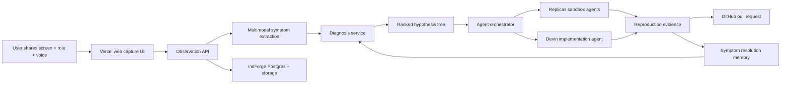

# Reflex Technical Document

## 1. Project Summary

Reflex is a role-aware, screen-aware debugging assistant for agentic software development. A user shares their screen, identifies their role, and describes a product problem in plain language. Reflex converts that moment into a structured engineering symptom, dispatches coding agents to reproduce the issue in sandboxed environments, and opens a pull request with evidence that the bug was reproduced and fixed.

The demo target is the InsForge Hackathon hosted by AI Nexus in San Francisco on June 6, 2026. The event is focused on agentic developer tools, coding agents, autonomous workflows, agent infrastructure, and AI-native engineering systems. Reflex is designed to be sponsor-native: InsForge provides backend infrastructure and diagnostic memory, Replicas and Devin handle agentic engineering work, Vercel hosts the web experience, and Limrun is an optional mobile reproduction path.

One-line judge pitch:

> Tag who you are, describe what is wrong while Reflex watches your screen, and it diagnoses the real engineering problem and dispatches coder agents to fix it. From a complaint to a merged PR, without a single ticket written.

## 2. Problem Statement

The people who encounter product failures are often not the engineers who can fix them. Sales, support, founders, and product managers describe symptoms in human terms, while engineering teams need reproducible technical evidence. The current handoff is slow and lossy:

- The bug reporter writes an imprecise ticket.
- Engineering asks for reproduction steps.
- Context is lost between screen recordings, logs, customer impact, and code changes.
- Multiple engineers may investigate the wrong root cause before a fix is proven.

Reflex collapses this gap by treating the original screen-and-voice moment as the source of truth, translating it through the correct role lens, and requiring sandbox reproduction before any fix is considered valid.

## 3. Goals

- Capture a user role, screen context, and natural-language problem report.
- Convert vague user language into a structured technical symptom.
- Generate a ranked hypothesis tree tied to codebase context.
- Dispatch coding agents in parallel to reproduce top hypotheses.
- Record reproduction evidence before writing or accepting a fix.
- Open a pull request linked to the original report, reproduction trace, and fix summary.
- Demonstrate sponsor usage in load-bearing parts of the architecture.

## 4. Non-Goals

- Fully robust always-on screen monitoring.
- Open-ended natural conversation across arbitrary applications.
- Multi-tenant enterprise administration.
- Production-grade privacy redaction for all screen content.
- Guaranteed fix generation for arbitrary repos.
- Native mobile reproduction unless the Limrun stretch path is implemented.

For the hackathon, Reflex should optimize for a reliable end-to-end spine on one seeded repository and one or two rehearsed symptoms.

## 5. User Roles and Diagnostic Lenses

The role tag is not cosmetic. It determines translation depth, prompt framing, hypothesis scope, and agent instructions.

| Role | User Input Style | Reflex Interpretation | Agent Brief |
| --- | --- | --- | --- |
| Sales / CSM | Customer-facing complaint | Map symptom to reproducible technical fault | Find user-visible failure and prove it |
| CEO / Founder | Strategic or business frustration | Decompose into candidate engineering causes | Identify measurable product bottleneck |
| Product | Desired behavior or workflow gap | Treat as feature specification | Scaffold implementation plan or PR |
| Engineer | Technical symptom | Skip business translation | Reproduce, localize, and patch directly |

Example:

- Sales says: "Every time this customer exports the big report, it hangs."
- Reflex produces: "Report generation hangs for large datasets; likely unbounded query, missing pagination, or timeout."
- Engineer says on the same screen: "Export endpoint times out on large datasets."
- Reflex produces: "Reproduce timeout on export endpoint with large dataset fixture; inspect query path and request timeout handling."

## 6. System Architecture



### 6.1 Components

#### Capture UI

Purpose: Collect the human report and show the live "reflex arc" pipeline.

Responsibilities:

- Let the user select a role.
- Start browser screen capture with `getDisplayMedia`.
- Capture voice transcript from a rehearsed or browser-supported speech flow.
- Submit screen snapshots and transcript chunks to the backend.
- Render pipeline status: observe, diagnose, dispatch, reproduce, fix, ship.

Hackathon discipline:

- Screen sharing should be real.
- Inputs should be rehearsed.
- The UI should not depend on open-mic robustness.

#### Observation API

Purpose: Persist the original source-of-truth report.

Responsibilities:

- Create a capture session.
- Store role, transcript, selected repo, screen snapshots, and timestamps.
- Normalize observations into a format suitable for diagnosis.
- Redact obvious secrets from transcripts and screenshots where practical.

#### Multimodal Symptom Extraction

Purpose: Convert screen frames and speech into structured observations.

Responsibilities:

- Extract visible UI state from screenshots.
- Combine screenshot observations with transcript text.
- Produce a concise symptom statement.
- Preserve uncertainty and missing evidence.

Implementation note:

The pasted concept mentions Gemini Live for screen and speech understanding. Gemini is not listed on the Luma event page as an event sponsor, so it should be treated as an optional model provider unless hackathon rules or sponsor guidance explicitly encourage its use. If sponsor alignment matters more, use InsForge model access or a sponsor-approved model path for the first version.

#### Diagnosis Service

Purpose: Convert the role-aware symptom into technical hypotheses.

Responsibilities:

- Apply the role lens.
- Load repo metadata and known issue memory.
- Produce a structured diagnosis object.
- Rank hypotheses by likelihood and ease of reproduction.
- Create agent briefs for sandbox execution.

Output contract:

```json
{
  "role": "sales",
  "symptom": "Report export hangs on large datasets",
  "evidence": [
    "User described export hang",
    "Screen shows report export loading state"
  ],
  "hypotheses": [
    {
      "title": "Unbounded report query",
      "confidence": 0.72,
      "reproductionPlan": "Seed 10k records and run report export",
      "expectedFailure": "Request exceeds timeout or UI spinner remains active"
    }
  ]
}
```

#### Agent Orchestrator

Purpose: Dispatch hypotheses to coding agents and consolidate results.

Responsibilities:

- Start one sandbox task per top hypothesis.
- Pass each agent the repo, symptom, reproduction plan, and expected failure.
- Stream task status to the UI.
- Select the first hypothesis that produces reproducible evidence.
- Hand confirmed fixes to the implementation agent when appropriate.

#### Replicas Sandbox Agents

Purpose: Run parallel hypothesis investigation in isolated environments.

Responsibilities:

- Clone or access the seeded demo repo.
- Run setup commands.
- Execute the reproduction plan.
- Capture logs, screenshots, test failures, or timing evidence.
- Propose or implement a minimal fix.

The key judging point is that confidence comes from reproduction, not from an LLM guess.

#### Devin Implementation Agent

Purpose: Implement the confirmed fix or feature after reproduction succeeds.

Responsibilities:

- Receive confirmed root cause and evidence.
- Modify the codebase.
- Run tests.
- Prepare a PR with a clear summary and verification notes.

Hackathon fallback:

If Devin API access is unavailable or slow, keep Replicas as the primary executor and describe Devin as the second-agent path in the roadmap.

#### InsForge Backend and Memory

Purpose: Provide backend primitives and persistent diagnostic memory.

Responsibilities:

- Store capture sessions, observations, diagnoses, hypotheses, agent runs, and PR metadata.
- Store screenshot artifacts.
- Maintain the symptom-resolution memory graph.
- Provide edge functions for lightweight orchestration if available.

Memory graph concept:

- Symptom: "export hangs on large datasets"
- Resolved location: `src/reports/export.ts`
- Cause: "unbounded query without pagination"
- Fix type: "add pagination and streaming response"
- Evidence: "large dataset export test passes"

## 7. Data Model

### 7.1 `capture_sessions`

| Field | Type | Description |
| --- | --- | --- |
| `id` | UUID | Session identifier |
| `role` | Text | User-selected role |
| `repo_url` | Text | Target repository |
| `status` | Text | Current pipeline state |
| `created_at` | Timestamp | Session start time |
| `completed_at` | Timestamp | Session completion time |

### 7.2 `observations`

| Field | Type | Description |
| --- | --- | --- |
| `id` | UUID | Observation identifier |
| `session_id` | UUID | Parent capture session |
| `transcript` | Text | User speech transcript |
| `screenshot_url` | Text | Stored screen snapshot |
| `visible_state` | JSON | Extracted UI state |
| `created_at` | Timestamp | Observation time |

### 7.3 `diagnoses`

| Field | Type | Description |
| --- | --- | --- |
| `id` | UUID | Diagnosis identifier |
| `session_id` | UUID | Parent capture session |
| `symptom` | Text | Structured engineering symptom |
| `role_lens` | Text | Role-specific translation strategy |
| `evidence` | JSON | Evidence extracted from screen and transcript |
| `created_at` | Timestamp | Diagnosis time |

### 7.4 `hypotheses`

| Field | Type | Description |
| --- | --- | --- |
| `id` | UUID | Hypothesis identifier |
| `diagnosis_id` | UUID | Parent diagnosis |
| `title` | Text | Short hypothesis name |
| `confidence` | Float | Ranked likelihood |
| `reproduction_plan` | Text | Sandbox instructions |
| `status` | Text | Pending, running, reproduced, rejected, fixed |

### 7.5 `agent_runs`

| Field | Type | Description |
| --- | --- | --- |
| `id` | UUID | Agent run identifier |
| `hypothesis_id` | UUID | Hypothesis being tested |
| `provider` | Text | Replicas, Devin, or fallback |
| `sandbox_url` | Text | Sandbox reference |
| `logs_url` | Text | Execution logs |
| `result` | JSON | Reproduction and fix result |
| `created_at` | Timestamp | Run start time |
| `completed_at` | Timestamp | Run completion time |

### 7.6 `pull_requests`

| Field | Type | Description |
| --- | --- | --- |
| `id` | UUID | Internal PR record |
| `session_id` | UUID | Source capture session |
| `agent_run_id` | UUID | Producing run |
| `github_url` | Text | Pull request URL |
| `summary` | Text | Fix summary |
| `verification` | Text | Tests or reproduction evidence |
| `created_at` | Timestamp | PR creation time |

## 8. API Surface

### `POST /api/sessions`

Creates a capture session.

Request:

```json
{
  "role": "sales",
  "repoUrl": "https://github.com/example/reporting-demo"
}
```

Response:

```json
{
  "sessionId": "sess_123",
  "status": "created"
}
```

### `POST /api/sessions/{sessionId}/observations`

Stores a transcript chunk and optional screenshot.

Request:

```json
{
  "transcript": "Every time I pull the big export it just hangs.",
  "screenshotBase64": "...",
  "timestampMs": 12000
}
```

Response:

```json
{
  "observationId": "obs_123",
  "status": "stored"
}
```

### `POST /api/sessions/{sessionId}/diagnose`

Generates a structured symptom and hypothesis tree.

Response:

```json
{
  "diagnosisId": "diag_123",
  "symptom": "Report export hangs on large datasets",
  "hypotheses": [
    {
      "id": "hyp_1",
      "title": "Unbounded report query",
      "confidence": 0.72
    }
  ]
}
```

### `POST /api/diagnoses/{diagnosisId}/dispatch`

Dispatches top hypotheses to agent sandboxes.

Response:

```json
{
  "runIds": ["run_1", "run_2", "run_3"],
  "status": "running"
}
```

### `GET /api/sessions/{sessionId}/events`

Streams pipeline events to the frontend over Server-Sent Events or WebSocket.

Event examples:

```json
{ "type": "diagnosis.created", "symptom": "Report export hangs on large datasets" }
{ "type": "agent.reproduced", "runId": "run_1", "evidence": "Export test timed out at 30s" }
{ "type": "pr.opened", "url": "https://github.com/example/reporting-demo/pull/42" }
```

## 9. End-to-End Flow

1. User selects `Sales / CSM`.
2. User shares the report export screen.
3. User says: "Every time the customer pulls the big export, it just hangs."
4. Capture UI sends transcript and screen snapshot to the Observation API.
5. Multimodal extraction identifies a report export loading state.
6. Diagnosis service creates the symptom: "Report export hangs on large datasets."
7. Diagnosis service ranks hypotheses:
   - Unbounded query.
   - Missing pagination.
   - Request timeout mismatch.
8. Orchestrator dispatches three sandbox agents through Replicas.
9. One agent seeds a large dataset and reproduces the hang.
10. The confirmed hypothesis is passed to the implementation path.
11. Agent writes a minimal fix.
12. Tests pass in the sandbox.
13. GitHub PR opens with reproduction evidence and a link to the source capture session.

## 10. Demo Repository Requirements

The demo repository should contain two or three seeded issues that map cleanly from vague user symptoms to reproducible technical failures.

Recommended primary bug:

- Surface symptom: report export spinner hangs.
- Root cause: unbounded database query or synchronous processing path.
- Reproduction: seed large dataset and trigger export.
- Fix: add pagination, streaming, batching, or query bound.
- Verification: export completes under defined timeout and test passes.

Recommended secondary bug:

- Surface symptom: onboarding feels slow.
- Root cause: redundant API calls or sequential loading.
- Reproduction: load onboarding page and measure network waterfall.
- Fix: parallelize fetches or cache stable data.
- Verification: loading time drops below threshold.

Recommended product-role feature:

- Surface request: product wants an export progress indicator.
- Implementation: add job status and progress UI.
- Verification: progress state updates during export.

## 11. Implementation Plan

### Phase 1: Build the Spine

- Create the seeded demo repo and reproducible bug.
- Define the diagnosis JSON contract.
- Build the orchestrator endpoint.
- Dispatch at least one agent task against a sandbox.
- Produce a PR from a confirmed reproduction.

Success criterion:

- A structured symptom can trigger a real sandbox reproduction and PR without relying on the capture UI.

### Phase 2: Add the Face

- Build the Vercel capture UI.
- Add role selection.
- Add screen capture and transcript input.
- Render the pipeline visualization.
- Feed the same structured symptom path built in Phase 1.

Success criterion:

- The UI can drive the already-working backend pipeline with rehearsed input.

### Phase 3: Add Sponsor Depth

- Persist session and run state in InsForge.
- Add Replicas parallel hypothesis dispatch.
- Add Devin as a confirmed-fix handoff if accessible.
- Add Limrun only for a mobile-specific stretch demo.

Success criterion:

- Each sponsor integration has a visible, necessary role in the demo.

## 12. Build / Fake / Name Cuts

Build:

- Structured symptom to hypothesis tree.
- Sandbox reproduction against a seeded repo.
- Minimal code fix.
- Pull request creation.
- Pipeline status UI.

Fake:

- Open-ended speech robustness.
- Fully live multimodal interpretation for arbitrary screens.
- Pre-warmed sandbox startup where needed.
- Pre-indexed repository context.

Name:

- Always-on continuous watching.
- Enterprise multi-tenant controls.
- Full diagnostic memory improvement loop.
- Mobile reproduction path unless Limrun is ready.

## 13. Verification Strategy

### Functional Tests

- Diagnosis contract validates required fields.
- Role lens changes generated agent brief.
- Hypotheses include reproduction plans.
- Agent run state transitions from pending to running to reproduced or rejected.
- PR metadata stores source session and evidence.

### Integration Tests

- Given a sales transcript and report screenshot, diagnosis produces the expected symptom.
- Given a structured export-hang symptom, the orchestrator dispatches expected sandbox tasks.
- Given a seeded large dataset, the reproduction command fails before the fix and passes after the fix.
- Given a successful fix, a PR record is created with verification notes.

### Demo Acceptance Test

The demo is ready when the team can run this script three times in a row:

1. Start from the capture UI.
2. Submit the sales-role report export complaint.
3. Watch diagnosis and hypothesis fan-out appear.
4. Confirm at least one sandbox reproduces the bug.
5. Confirm the fix is generated.
6. Open the PR and show the evidence.

## 14. Security and Privacy

The hackathon implementation is not production-ready for sensitive screen data, but it should still follow basic safety rules:

- Store only the screenshots needed for the demo.
- Avoid capturing the entire desktop when a browser tab is enough.
- Redact obvious secrets from transcript text.
- Use scoped GitHub tokens for the demo repository only.
- Keep sandbox credentials separate from user-facing session data.
- Link PRs to evidence without exposing unnecessary screenshots publicly.

Production requirements would include screenshot redaction, data retention controls, organization-level access control, audit logs, and explicit consent UX.

## 15. Technical Risks

| Risk | Impact | Mitigation |
| --- | --- | --- |
| Replicas programmatic dispatch is unavailable | Cannot automate parallel sandbox fan-out | Use manual or webhook-triggered task dispatch; keep one real sandbox path |
| Devin API access is unavailable | Cannot show second-agent handoff | Keep Devin as roadmap or manually queued executor |
| Multimodal extraction is unreliable | Diagnosis may drift | Use rehearsed inputs and structured transcript fallback |
| Sandbox startup is slow | Demo stalls | Pre-warm or show precomputed run if network fails |
| Agent fixes wrong code | Demo loses credibility | Use seeded bugs with deterministic tests |
| Sponsor APIs differ from assumptions | Integration delays | Verify API surfaces before building UI polish |

## 16. Open Questions to Verify

- Does Replicas expose a programmatic API for dispatching agent tasks, or only integrations through Slack, Linear, GitHub, and similar tools?
- What is the fastest reliable way to pass a confirmed fix task into Devin during the hackathon?
- Which model path should handle screen and voice extraction while preserving sponsor alignment?
- Which InsForge primitives are available for storage, Postgres, auth, edge functions, and model access in the hackathon environment?
- Can Limrun be integrated quickly enough to justify a mobile stretch demo?
- What are the official judging criteria and sponsor-specific prize requirements on the day?

## 17. Hackathon Demo Script

Opening:

"Reflex fixes the handoff between the person who sees the bug and the engineer who has to prove and fix it."

Demo:

1. Select `Sales / CSM`.
2. Share a screen showing the report export spinner.
3. Say: "Every time the customer pulls the big export, it just hangs."
4. Show the structured symptom.
5. Show three hypotheses lighting up.
6. Show Replicas agents running in parallel.
7. Show one sandbox reproducing the hang.
8. Show the code fix and passing test.
9. Open the PR linked to the source report.

Closer:

Switch the role to `CEO / Founder` on the same screen and say: "Reporting feels slow." Reflex should produce a broader diagnosis with performance and workflow hypotheses instead of a narrow customer bug report. This proves the role tag changes the engineering lens.

## 18. Success Criteria

The hackathon project is successful if judges see:

- A real source-of-truth screen and voice report.
- A clear role-aware translation into engineering language.
- A ranked hypothesis tree.
- Parallel or sandboxed agent investigation.
- Reproduction evidence before the fix.
- A real PR that ties the fix back to the original report.

The minimum winning spine is:

```text
structured symptom -> sandbox reproduction -> fix -> green PR
```

Everything before that spine can be scripted. Everything after that spine can be roadmap.

## 19. Sources

- InsForge Hackathon Luma page: https://luma.com/ainexus-t0fl
- Project concept notes provided during planning.
